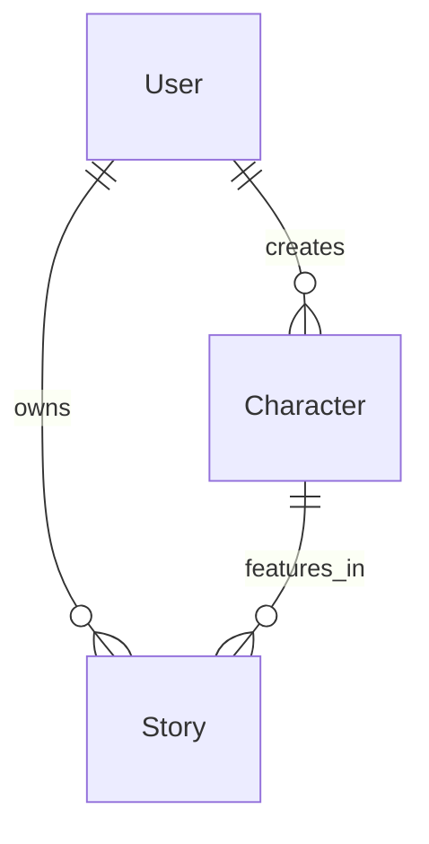

# Current Data Structure Analysis

## Overview
This document outlines the current data structures and relationships in the AI Dungeon Story Game, focusing on what data is stored and managed at the backend.

## User Data
### User Model
- `userId`: MongoDB ObjectId (Primary Key)
- `username`: String
- `email`: String
- `password`: String (hashed)
- `createdAt`: Date
- `updatedAt`: Date

## Character System
### Character Model
```typescript
{
  userId: ObjectId (ref: "User")
  name: string
  class: "fire-mage" | "dark-mage" | "light-mage" | "archer" | "crimson" | "rapier" | "swordsmen"
  stats: {
    strength: number (1-10)
    intelligence: number (1-10)
    health: number (1-10)
    agility: number (1-10)
    magic: number (1-10)
  }
  abilities: string[]
  createdAt: Date
  updatedAt: Date
}
```

### Character Classes
Each character class has:
1. **Fire Mage**
   - Specializes in fire-based magic attacks
   - High magic and intelligence stats
   - Special abilities: Fireball Strike, Phoenix Rising, Inferno Wave

2. **Dark Mage**
   - Dark magic specialist
   - High magic and intelligence stats
   - Abilities focused on curses and debuffs

3. **Light Mage**
   - Healing and support magic
   - High intelligence and agility stats
   - Abilities focused on healing and buffs

4. **Archer**
   - Ranged physical attacks
   - High agility and strength stats
   - Abilities focused on precision and range

5. **Crimson**
   - Melee combat specialist
   - High strength and health stats
   - Abilities focused on close combat

6. **Rapier**
   - Swift melee fighter
   - High agility and strength stats
   - Abilities focused on quick strikes

7. **Swordsmen**
   - Balanced melee fighter
   - Even distribution of stats
   - Abilities focused on versatile combat

## Game Flow
1. **Landing Page** (`/`)
   - Basic game information
   - Sign in/Sign up options
   - No persistent data

2. **Dashboard** (`/dashboard`)
   - Displays user's active stories
   - Shows character information
   - Last played timestamp
   - Story progress (current chapter)

3. **Character Selection**
   - Displays available character classes
   - Each class has predefined stats and abilities
   - Character data is stored once selected

## Backend APIs
1. **Authentication**
   - `/api/auth/sign-in`: POST
   - `/api/auth/sign-up`: POST
   - `/api/auth/sign-out`: POST

2. **Dashboard**
   - `/api/dashboard`: GET
     ```typescript
     Response: {
       stories: {
         id: string
         title: string
         currentChapter: number
         lastPlayed: Date
         character: {
           name: string
           class: string
         }
       }[]
       user: {
         id: string
         username: string
         email: string
       }
     }
     ```

3. **Character**
   - `/api/characters`: GET, POST
   - `/api/characters/:id`: GET, PUT, DELETE

## Database Relationships


## Current State
1. **Implemented**
   - User authentication system
   - Character creation and selection
   - Basic dashboard functionality
   - Character stats and abilities system

2. **Pending Implementation**
   - Story generation system
   - Game progression mechanics
   - Combat system
   - Character development

## Next Steps
1. Implement story generation system
2. Create story progression mechanics
3. Develop combat system
4. Add character progression
5. Implement save/load functionality
