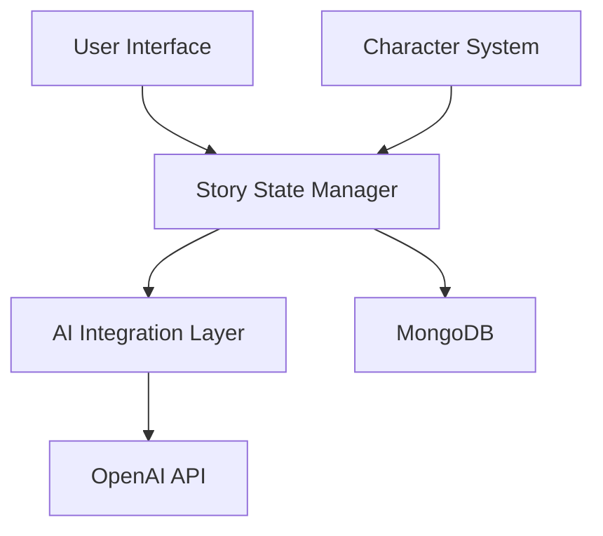

# Story Development Plan

## Overview
This document outlines the development plan for implementing the AI-driven story generation system in our game. The plan is divided into backend and frontend components, with clear steps for implementation.

## Architecture Overview


## Backend Development

### 1. Data Models and Types
#### Files to Create:
- `/src/types/story.ts`
  ```typescript
  interface StoryContext {
    genre: string
    theme: string
    tone: string
    setting: string
    mainQuest: string
  }

  interface WorldState {
    currentLocation: string
    timeOfDay: string
    weather: string
    importantNPCs: Array<{
      name: string
      relationship: string
      lastInteraction: string
    }>
  }

  interface CharacterState {
    health: number
    magic: number
    lastDecision: string
    recentActions: string[]
    inventory: string[]
    questProgress: string
  }

  interface StoryProgress {
    chapter: number
    majorEvents: string[]
    unlockedLocations: string[]
    completedQuests: string[]
    currentObjectives: string[]
  }
  ```

- `/src/models/story.ts`
  - MongoDB schema implementing the above interfaces
  - Relationships with Character model
  - Methods for state updates

### 2. AI Integration Layer
#### Files to Create:
- `/src/lib/ai/story-generator.ts`
  - Main story generation logic
  - OpenAI API integration
  - Context management

- `/src/lib/ai/prompt-templates.ts`
  ```typescript
  const TEMPLATES = {
    STORY_START: `
      Create an engaging story start for a {genre} adventure with:
      Character: {characterClass} named {characterName}
      Setting: {setting}
      Theme: {theme}
      Tone: {tone}
      Initial Quest: {mainQuest}
    `,
    CHAPTER_GENERATION: `
      Continue the story with:
      Previous Events: {recentEvents}
      Character Status: {characterState}
      World State: {worldState}
      Current Objectives: {objectives}
    `,
    CHOICE_GENERATION: `
      Generate meaningful choices that:
      1. Reflect character abilities
      2. Impact the story direction
      3. Consider current state
      Context: {currentContext}
    `
  }
  ```

- `/src/lib/ai/context-manager.ts`
  - Story context tracking
  - State management for AI
  - History maintenance

### 3. API Endpoints
#### Files to Create:
- `/src/app/api/story/generate/route.ts`
  - Story generation endpoint
  - Choice processing
  - State updates

- `/src/app/api/story/state/route.ts`
  - Story state management
  - Save/load functionality

## Frontend Development

### 1. Story State Management
#### Files to Create:
- `/src/lib/story-state.ts`
  - Story progression logic
  - State management utilities

- `/src/hooks/use-story-state.ts`
  - React hook for story management
  - UI state synchronization

### 2. UI Components
#### Files to Create:
- `/src/components/story/story-container.tsx`
  ```typescript
  interface StoryContainerProps {
    storyId: string
    character: Character
    onChoice: (choice: Choice) => void
  }
  ```

- `/src/components/story/world-state-display.tsx`
  - World state visualization
  - Environment indicators

- `/src/components/story/character-status.tsx`
  - Character stats display
  - Inventory management

### 3. Story Page
#### Files to Create:
- `/src/app/story/[id]/page.tsx`
  - Main story page
  - Component integration
  - Layout management

## Implementation Steps

### Phase 1: Foundation (Week 1)
1. Create basic data models and types
2. Set up MongoDB schemas
3. Implement basic API endpoints
4. Create story state management

### Phase 2: AI Integration (Week 2)
1. Set up OpenAI API integration
2. Implement prompt templates
3. Create context management system
4. Test story generation

### Phase 3: UI Development (Week 3)
1. Build core UI components
2. Implement state management hooks
3. Create story page layout
4. Add basic animations

### Phase 4: Enhancement (Week 4)
1. Add advanced story features
2. Implement save/load functionality
3. Add error handling
4. Polish UI/UX

## Testing Strategy

### Unit Tests
- Test story generation logic
- Validate state management
- Check API endpoints

### Integration Tests
- Test AI integration
- Verify database operations
- Check state synchronization

### E2E Tests
- Complete story flow
- Character interaction
- Save/load functionality

## Monitoring and Analytics

### Story Generation Metrics
- Generation time
- Context size
- Token usage
- Error rates

### User Engagement Metrics
- Time per chapter
- Choice distribution
- Story completion rate

## Dependencies
- OpenAI API
- MongoDB
- Next.js
- TailwindCSS
- Framer Motion
- React Query

## Environment Variables
```env
OPENAI_API_KEY=
MONGODB_URI=
NEXT_PUBLIC_API_URL=
```

## Notes
- Keep story context under OpenAI's token limit
- Implement proper error handling for AI failures
- Cache generated content when possible
- Use optimistic updates for better UX
- Implement proper type safety throughout
